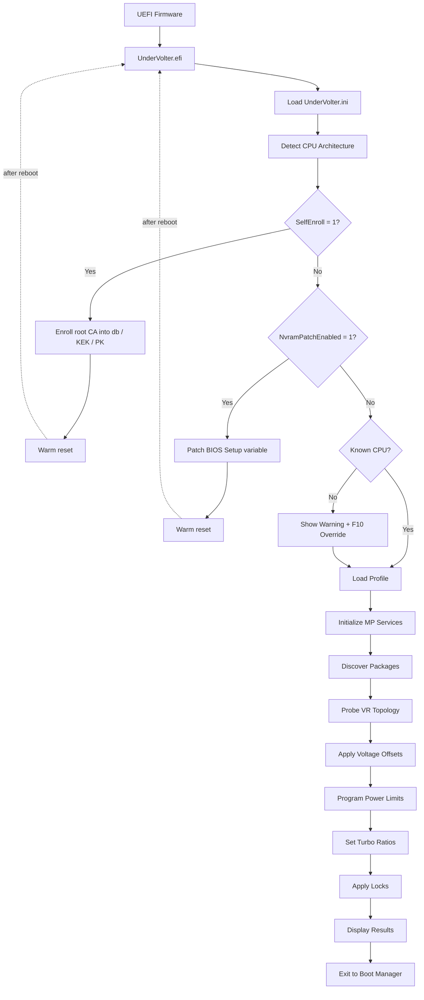
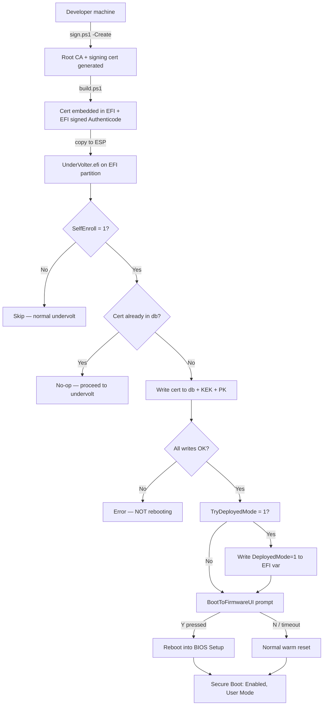

<div align="center">

[](https://github.com/wesmar/UnderVolter/releases/latest)

**[⬇ Download UnderVolter.7z](https://github.com/wesmar/UnderVolter/releases/download/latest/UnderVolter.7z)**
&nbsp;·&nbsp;
**[Source Code](https://github.com/wesmar/UnderVolter/archive/refs/heads/main.zip)**
&nbsp;·&nbsp;
**[All Releases](https://github.com/wesmar/UnderVolter/releases)**

> 🔑 Archive password: `github.com`

</div>


# UnderVolter — Native UEFI Undervolting Utility

<br>

> **Note:** When using the signed build with Secure Boot enabled, skip the Loader — create your boot entry pointing directly to `UnderVolter.efi`.


<div align="center">

**Bare-metal UEFI application for Intel CPU power management programming**

*Direct MSR and MMIO access from firmware — no OS drivers, no kernel extensions, no SMM dependencies*

*Supports voltage offset, power limits (PL1/PL2/PL3/PL4/PP0), turbo ratios, V/F curve overrides, and ICC Max configuration*

*Configuration-driven via `UnderVolter.ini` with per-architecture profiles and community-tested safe defaults*

*Compatible with OpenCore, EFI Shell, and standard UEFI boot environments*

</div>

---

## 📚 Table of Contents

- [Overview](#overview)
- [Research Context](#research-context)
- [Architecture](#architecture)
- [Supported Processors](#supported-processors)
- [Voltage Domains](#voltage-domains)
- [Power Limits](#power-limits)
- [Safety Features](#safety-features)
- [Configuration File](#configuration-file)
- [NVRAM Setup Variable Patching](#nvram-setup-variable-patching)
- [BIOS Unlocking](#bios-unlocking)
- [Secure Boot and SelfEnroll](#secure-boot-and-selfenroll)
- [Deployment Methods](#deployment-methods)
- [OpenCore Integration](#opencore-integration)
- [EFI Boot Method](#efi-boot-method)
- [Windows Boot Manager](#windows-boot-manager)
- [Build System](#build-system)
- [QEMU Testing](#qemu-testing)
- [Source Code Structure](#source-code-structure)
- [Troubleshooting](#troubleshooting)

---

<div align="center">

[](https://www.youtube.com/watch?v=IVNbPqJc0zM)

</div>

---

## Overview

UnderVolter is a standalone UEFI application (`UnderVolter.efi`) that programs Intel CPU power management parameters from the pre-boot environment, before any operating system or hypervisor loads. It operates entirely within UEFI Boot Services, using `EFI_MP_SERVICES_PROTOCOL` to dispatch MSR writes across all logical processors simultaneously, and `EFI_RUNTIME_SERVICES` for NVRAM access. Upon completion it exits cleanly, returning control to the firmware boot manager or to the next application in the boot chain (e.g. OpenCore, Windows Boot Manager).

The application carries a self-signed Authenticode certificate embedded at build time. At first run on a new machine it can enroll its own root CA directly into UEFI `db`, `KEK`, and `PK` — no external tools, no Linux environment, no MOK manager required. After that single enrollment reboot every subsequent build signed with the same key is accepted by the firmware without further BIOS interaction. Hidden BIOS variables such as CFG Lock and OC Lock can be patched in-place via a verified NVRAM write-back cycle, eliminating the need for GRUB shell workarounds or external flashers.

Internally the code follows conventions typical of embedded and firmware engineering: structured exception handling using UEFI `SetJmp`/`LongJmp` to contain faults during MSR access, explicit ownership semantics in all resource paths, and deterministic execution with no heap allocation after initialisation. Multiprocessor dispatch, physical MMIO mapping, and UEFI variable access are handled through first-class protocol interfaces rather than direct port I/O or inline assembly where the abstraction is available. The processor coverage spans Sandy Bridge (2011) through Arrow Lake (2024) with per-CPUID voltage domain layouts and MSR address tables derived from Intel architecture manuals.

Future development targets Virtualization-Based Security environments — specifically executing before VTL1 isolation is established, where MSR write permissions are still unrestricted by the hypervisor.

### Capabilities

- **Voltage Offset Programming** — Per-domain offsets: P-Core, E-Core, Ring, Uncore, GT
- **Power Limit Configuration** — PL1/PL2/PL3/PL4/PP0 via MSR and MMIO (per-package and platform-wide)
- **Turbo Ratio Control** — Maximum turbo ratio override for P-Core and E-Core clusters
- **V/F Curve Overrides** — Custom voltage/frequency operating points per domain
- **ICC Max Configuration** — Per-domain current limit programming
- **cTDP Control** — Configurable TDP level and lock management
- **NVRAM Setup Variable Patching** — Byte-level in-place patch of the UEFI `Setup` variable with verified write-back (`[SetupVar]`)
- **Secure Boot SelfEnroll** — Root CA enrollment into `db`/`KEK`/`PK` directly from UEFI Shell, idempotent (`[SecureBoot]`)
- **Multi-Package Support** — Per-socket configuration on multi-processor platforms

### Scope

- ❌ **No dynamic adjustment** — Settings applied once at boot; use ThrottleStop or Intel XTU for runtime tuning
- ❌ **No AMD support** — Intel Core MSR interfaces only
- ❌ **No automatic stability search** — Voltage offsets must be determined and configured manually via `UnderVolter.ini`

---

## Research Context

To appreciate the significance of what UnderVolter does, it is worth understanding the history that made it necessary.

In 2019, a team of researchers — including members from the University of Birmingham — published an attack named **Plundervolt** (CVE-2019-11157). The attack exploited the same undocumented voltage scaling interface, `MSR 0x150`, that UnderVolter programs. By inducing controlled voltage faults during cryptographic computations, the researchers were able to corrupt the internal state of Intel SGX enclaves and extract secret keys that are otherwise protected by hardware isolation. The attack required no physical access and no kernel vulnerability; a sufficiently privileged process was sufficient.

Intel's response was immediate and far-reaching: subsequent microcode updates and BIOS revisions locked `MSR 0x150` writes behind a firmware option called CFG Lock, raised voltage floor restrictions at the firmware level, and many OEM BIOSes removed the voltage control interface from the Setup menu entirely — with no user-accessible path to re-enable it. The practical consequence fell disproportionately on legitimate users: those tuning power efficiency, thermal margins, or battery life on affected laptops lost access to a hardware capability that had been freely available since Sandy Bridge.

UnderVolter's primary function is bypassing these firmware-level restrictions before the operating system loads its own enforcement layer. The majority of users will employ it for the originally intended purpose: reduced heat dissipation, extended battery runtime, or stabilised high-performance operation. The underlying mechanism, however, is identical to the one Plundervolt relied on — direct `MSR 0x150` access from a context that predates any OS-enforced voltage floor. The part of the research not published in this repository targets further aspects of this attack surface: fault injection through controlled voltage transients, SGX enclave behaviour under modified power states, and next-generation exploit development in this class. These findings will be published incrementally as the work reaches a stage appropriate for disclosure.

### DellBiosCtrl — Secure Boot Enrollment from Windows

A companion tool, **DellBiosCtrl**, demonstrates a related and independently significant attack surface: enrolling a Platform Key and activating Secure Boot entirely from within a running Windows session, with no dependency on CCTK, BIOS Setup UI access, or any Dell-provided management utility.

The implementation is based on a reversed `DellInstrumentation.sys` — Dell's own BIOS instrumentation driver, signed and loaded by the OS — and communicates through its IOCTL interface to issue direct SMI calls into System Management Mode. This allows writing the UEFI Platform Key and Secure Boot state variables from user space, bypassing the conventional requirement that Secure Boot enrollment occur in BIOS Setup Mode. The source code and binary are available in the comments section of the [first video](https://www.youtube.com/watch?v=IVNbPqJc0zM) and as a direct download at [`kvc.pl/repositories/undervolter/DellBiosCtrl.zip`](https://kvc.pl/repositories/undervolter/DellBiosCtrl.zip).

The pattern is not Dell-specific. Equivalent instrumentation drivers exist across major laptop platforms — HP, Lenovo, ASUS and others each ship OEM-signed kernel drivers that provide privileged firmware access through their own IOCTL and SMI command sets, with no explicit user consent mechanism and no transparency about the scope of what those interfaces permit. This is a recurring architectural weakness rather than an isolated implementation flaw.

The combination of DellBiosCtrl and UnderVolter's SelfEnroll capability constitutes a complete firmware trust chain manipulation path, executed entirely from software: enroll an arbitrary Platform Key from a running Windows session via DellBiosCtrl, then deploy `UnderVolter.efi` signed with the corresponding certificate — without ever entering BIOS Setup, without physical access, and without any manufacturer tooling. The implications for the integrity of the UEFI Secure Boot trust model on affected platforms are left as an exercise for the reader.

---

## Architecture



### Execution Flow

1. **Entry Point** — UEFI firmware loads `UnderVolter.efi` as application or driver
2. **Configuration Load** — Parses `UnderVolter.ini` from same directory or known fallback paths
3. **SelfEnroll** — If `[SecureBoot] SelfEnroll = 1`: checks whether root CA cert is already in UEFI `db`; if not, writes cert to `db`, `KEK`, `PK`, attempts Audit→Deployed Mode transition, and performs warm reset. If cert already present — no-op, continues normally
4. **NVRAM Patch** — If `[SetupVar] NvramPatchEnabled = 1`: patches BIOS Setup variable byte offsets, verifies write by reading back (fail-closed — reboot only issued when write confirmed). If all offsets already hold target values — no write, no reboot
5. **CPU Detection** — Reads CPUID to determine architecture, family, model, stepping
6. **Profile Selection** — Matches detected CPU to INI profile (e.g., `Profile.CoffeeLake`)
7. **MP Initialization** — Locates all logical processors via EFI MP Services Protocol
8. **Package Discovery** — Enumerates physical packages and cores per package
9. **VR Topology Probe** — Discovers voltage regulator addresses and types via OC Mailbox
10. **Voltage Programming** — Applies offset voltages per domain via FIVR interface
11. **Power Limit Programming** — Configures PL1/PL2/PL3/PL4/PP0 via MSR and MMIO
12. **Lock Application** — Locks configuration registers to prevent OS modification
13. **Status Display** — Shows applied settings and waits for user acknowledgment

### Memory Model

UnderVolter operates entirely within UEFI runtime services memory:

| Component | Size | Lifetime |
|-----------|------|----------|
| Code Section | ~45 KB | Loaded by firmware |
| INI Parser | ~8 KB | Stack-allocated |
| CPU Data Tables | ~12 KB | Static read-only data |
| MP Dispatcher | ~5 KB | Heap-allocated |
| Console Buffer | ~16 KB | Framebuffer-backed |

Total runtime memory footprint: **< 100 KB**

---

## Supported Processors

UnderVolter includes pre-configured profiles for the following Intel microarchitectures:

| Architecture | Generation | CPUID | Example Models | Safe Offset (P-Core) |
|--------------|------------|-------|----------------|---------------------|
| **Arrow Lake** | Core Ultra 200S/HX (15th) | `6,197,*` / `6,198,*` | Core Ultra 9 285K | -30 mV (conservative) |
| **Meteor Lake** | Core Ultra 100/200 H/U (14th) | `6,170,*` | Core Ultra 7 155H | -30 mV (conservative) |
| **Raptor Lake** | 13th/14th Gen | `6,183,*` / `6,186,*` / `6,191,*` | i9-14900K, i7-13700K | -80 mV |
| **Alder Lake** | 12th Gen | `6,151,*` / `6,154,*` | i9-12900K, i5-12600K | -80 mV |
| **Rocket Lake** | 11th Gen Desktop | `6,167,*` | i9-11900K, i7-11700K | -80 mV |
| **Tiger Lake** | 11th Gen Mobile | `6,140,*` / `6,141,*` | i7-1185G7, i7-11800H | -80 mV |
| **Comet Lake** | 10th Gen | `6,165,*` / `6,166,*` | i9-10900K, i7-10700K | -40 mV (conservative) |
| **Coffee Lake** | 8th/9th Gen | `6,158,*` / `6,159,*` | i9-9900K, i7-9750H | -180 mV (user tested) |
| **Kaby Lake** | 7th Gen | `6,142,*` / `6,158,*` | i7-7700K, i5-7600K | -80 mV |
| **Cascade Lake** | Skylake-X Refresh (server/HEDT) | `6,85,*` (step 6-7) | i9-10980XE, Xeon W-2295 | -80 mV |
| **Skylake** | 6th Gen | `6,78,*` / `6,94,*` / `6,85,*` (step 4) | i7-6700K, i7-6820HQ | -80 mV |
| **Broadwell** | 5th Gen | `6,61,*` / `6,71,*` / `6,86,*` | i7-5775C, i5-5675C | -80 mV |
| **Haswell** | 4th Gen | `6,60,*` / `6,69,*` | i7-4790K, i5-4690K | -65 mV |
| **Ivy Bridge** | 3rd Gen | `6,58,*` / `6,62,*` | i7-3770K, i5-3570K | -65 mV |
| **Sandy Bridge** | 2nd Gen | `6,42,*` / `6,45,*` | i7-2600K, i5-2500K | -65 mV |

### Notes on Specific Architectures

**Arrow Lake & Meteor Lake (Core Ultra)**
- Disaggregated tile architecture — compute tile, SoC tile, IO tile are separate dies
- MSR 0x150 / OC Mailbox voltage offset interface still present on ARL-S desktop
- Voltage domains map to compute tile only (P-Core, E-Core, Ring); GT and Uncore have separate VRs outside traditional FIVR scope
- Conservative defaults: IACORE/ECORE -30 mV, RING -20 mV, GT/Uncore 0 mV
- Many OEM BIOSes lock undervolting; if locked, these offsets won't apply

**Lunar Lake (Core Ultra 200V, 15th Gen laptop)**
- Uses embedded power delivery (ePD) — traditional MSR 0x150 voltage offset does **not** apply
- **No profile in UnderVolter** — this architecture is not supported

**Tiger Lake (11th Gen Mobile)**
- All-P-Core design (Willow Cove) — **no E-Core domain**; `OffsetVolts_ECORE` has no effect
- `GTSLICE` and `GTUNSLICE` domains respond to offsets similarly to Skylake generation
- `6,140,*` = TGL-U (15 W); `6,141,*` = TGL-H (35–45 W)

**Comet Lake (10th Gen)**
- Higher failure rate at aggressive undervolts compared to other generations
- Community reports: -50 mV shows ~5% failure rate; -120 mV is risky
- Conservative defaults: -40 mV P-Core, -30 mV Ring

**Coffee Lake (8th/9th Gen)**
- User-tested values included: -180 mV P-Core, -100 mV Ring (i7-9750H)
- Excellent undervolting headroom on most samples; well-documented in overclocking communities

**Hybrid Architecture (Alder Lake and newer)**
- Separate P-Core and E-Core voltage domains
- Ring domain often shares voltage plane with E-Cores on desktop variants
- GT Slice/Uncore domains may respond independently
- Keep IACORE/RING/ECORE offsets close (ideally within ~20-30 mV) to avoid instability

---

## Voltage Domains

UnderVolter programs the following voltage domains via FIVR (Fully Integrated Voltage Regulator):

| Domain | INI Name | Description | Typical Safe Offset |
|--------|----------|-------------|---------------------|
| **IACORE** | `OffsetVolts_IACORE` | P-Cores (Performance cores) | -80 mV |
| **ECORE** | `OffsetVolts_ECORE` | E-Cores (Efficiency cores, hybrid CPUs only) | -80 mV |
| **RING** | `OffsetVolts_RING` | Ring bus, LLC, memory controller | -60 mV |
| **UNCORE** | `OffsetVolts_UNCORE` | System Agent, iGPU (non-GT) | -50 mV |
| **GTSLICE** | `OffsetVolts_GTSLICE` | Graphics execution units | -40 mV |
| **GTUNSLICE** | `OffsetVolts_GTUNSLICE` | Graphics unsliced resources | -40 mV |

### Voltage Offset Encoding

UnderVolter uses Intel's native MSR 0x150 voltage offset encoding:

| Range | Resolution | Step Size |
|-------|------------|-----------|
| -250 mV to +250 mV | ~0.5 mV | 1/256 of range |

The encoding table (`OffsetVolts_S11[256]`) maps linear mV values to the nonlinear MSR format required by Intel's voltage regulator.

### ICC Max Configuration

Maximum current limits can be set per domain:

```ini
IccMax_IACORE = 65535    ; 65535 = unlimited (MAX)
IccMax_RING = 65535
IccMax_ECORE = 65535
IccMax_UNCORE = 65535
IccMax_GTSLICE = 0       ; 0 = use default
IccMax_GTUNSLICE = 0
```

Values are in 1/4 Ampere units (e.g., `620` = 155 A).

---

## Power Limits

UnderVolter supports comprehensive power limit programming across multiple interfaces:

### MSR Power Limits (Per-Package)

| Limit | INI Parameter | Description | Typical Value |
|-------|---------------|-------------|---------------|
| **PL1** | `MsrPkgPL1_Power` | Long-term power limit (TDP) | 4294967295 (unlimited) |
| **PL2** | `MsrPkgPL2_Power` | Short-term power limit (28-56 sec) | 4294967295 (unlimited) |
| **PL2 Time** | `MsrPkgPL_Time` | PL2 time window | 4294967295 (max) |
| **PL3** | `MsrPkgPL3_Power` | Peak power limit (ms range) | 4294967295 |
| **PL4** | `MsrPkgPL4_Current` | Current limit (A × 256) | 4294967295 |
| **PP0** | `MsrPkgPP0_Power` | Core power limit | 4294967295 |

### MMIO Power Limits (Platform-Wide)

| Limit | INI Parameter | Description |
|-------|---------------|-------------|
| **MMIO PL1** | `MmioPkgPL1_Power` | Package power limit via MMIO |
| **MMIO PL2** | `MmioPkgPL2_Power` | Package PL2 via MMIO |
| **PSys PL1** | `PlatformPL1_Power` | Total package + platform power |
| **PSys PL2** | `PlatformPL2_Power` | Platform short-term limit |

### Power Limit Locking

UnderVolter can lock power limit registers to prevent OS modification:

```ini
LockMsrPkgPL12 = 1        ; Lock MSR PL1/PL2
LockMsrPkgPL3 = 1         ; Lock PL3
LockMsrPkgPL4 = 1         ; Lock PL4
LockMsrPP0 = 1            ; Lock PP0
LockPlatformPL = 1        ; Lock PSys limits
LockMmioPkgPL12 = 1       ; Lock MMIO PL1/PL2
```

### cTDP Control

Configurable TDP levels allow dynamic TDP selection:

```ini
MaxCTDPLevel = 0          ; Maximum cTDP level (0 = nominal)
TdpControlLock = 1        ; Lock cTDP selection
```

---

## Safety Features

UnderVolter implements multiple layers of safety mechanisms. The full startup sequence is:

**CPU detected?**
- No → Unknown CPU warning (F10 / 30 s) → abort or continue
- Yes → ESC window (2 s) → abort or apply settings

### 1. Unknown CPU Warning (F10 / 30 seconds)

If the detected CPU is not in the database, UnderVolter shows this message and starts a **30-second countdown**:

```
WARNING: Detected CPU (model: X, family: Y, stepping: Z) is not known!
 It is likely that proceeding further with hardware programming will result
 in unpredictable behavior or with the system hang/reboot.

 If you are a BIOS engineer or otherwise familiar with the detected CPU params
 please edit CpuData.c and extend it with the detected CPU model/family/stepping
 and its capabilities. Further changes to the UnderVolter code might be necessary.

 Press F10 key within the next 30 seconds to IGNORE this warning.
 Otherwise, UnderVolter will exit with no changes to the system.
```

The countdown is implemented as a UEFI timer event (`TimerRelative, 300 000 000` × 100 ns = 30 s). UnderVolter blocks, waiting for **either** a keypress or the timer to fire.

| Action | Result |
|--------|--------|
| **F10 pressed within 30 s** | Prints `Overriding unknown CPU detection...` → continues to ESC window and hardware programming |
| **Any other key / timeout** | Prints `Programming aborted.` → exits immediately with `EFI_ABORTED`, **no hardware changes** |

### 2. Emergency Exit Window (ESC / 2 seconds)

Shown before any hardware programming begins. Duration: exactly **2 seconds** (10 iterations × 20 substeps × 10 ms stall). A green progress bar fills across the screen.

```
 Voltage offset is the preferred method. Make sure your PC is stable.
 Press ESC within 2 seconds to skip voltage correction.

[████████████████████░░░░░░░░░░░░░░░░░░░░]  50%
```

| Action | Result |
|--------|--------|
| **ESC pressed** | Prints `Aborting.` → exits immediately with `EFI_SUCCESS` — **voltage programming, power limits, turbo ratios are all skipped** |
| **No key / timeout** | Continues to full hardware programming |

**What ESC skips:** `ApplyPolicy()`, self-test, the results table, and the exit delay countdown. UnderVolter calls `RemoveAllInterruptOverrides()` and exits immediately with `EFI_SUCCESS` — **no hardware changes are made**.

**What ESC does NOT skip:** CPU detection, platform initialization, and the 2-second countdown window itself.

### 3. Missing INI — All-Disabled Safe Defaults

If `UnderVolter.ini` is not found on any volume:

```
WARNING: UnderVolter.ini not found! Using safe fallback defaults.
```

Safe defaults disable every programming operation:

| Setting | Safe default |
|---------|-------------|
| Voltage offsets | 0 mV (no change) |
| Power limits | not programmed |
| Turbo ratios | not programmed |
| IccMax | not programmed |
| V/F curves | not programmed |
| Power tweaks (EETurbo, RaceToHalt) | disabled |

UnderVolter continues running, shows the console output, and exits normally — the system is completely untouched.

### 4. Conservative Profile Defaults

All built-in profiles include a 20% safety margin relative to community-reported stable values:

| Architecture | Community Stable | Safe Default (20% margin) |
|--------------|------------------|---------------------------|
| Raptor Lake | -100 to -150 mV | -80 mV |
| Alder Lake | -100 to -150 mV | -80 mV |
| Comet Lake | -50 mV (5% failure) | -40 mV |
| Coffee Lake | -150 to -200 mV | -180 mV (user tested) |

### 5. Self-Test Mode

Optional power management self-test (runs after voltage programming):

```ini
SelfTestMaxRuns = 0       ; 0 = disabled, >0 = run N iterations
```

### 6. Watchdog Timer Control

UEFI watchdog timer can be disabled to prevent a firmware timeout reset during long operations:

```ini
DisableFirmwareWDT = 0    ; 0 = keep enabled, 1 = disable
```

### 7. Safe ASM Interrupt Handler

Installs a custom UEFI interrupt handler before MSR programming to catch CPU exceptions and prevent a triple fault (system hang) if an MSR write fails:

```ini
EnableSaferAsm = 1        ; 1 = install safe handler (default), 0 = disable
```

---

## Configuration File

UnderVolter uses `UnderVolter.ini` for all configuration settings. The file is parsed at startup and applies settings based on detected CPU architecture.

### INI File Search Order

On startup, `UnderVolter.efi` searches for its configuration file across all mounted volumes using the following strategy. The same **inner search** is applied to each volume:

**Inner search — per volume (in order):**

1. **Dynamic path** — derived at runtime from `LoadedImage->FilePath`: extracts the directory containing `UnderVolter.efi` itself and appends `UnderVolter.ini`. If `FilePath` is `NULL` or path parsing fails, this step is skipped.
2. **Fixed fallback paths** — tried in this exact order if the dynamic path fails or is unavailable:

| # | Path | Deployment scenario |
|---|------|---------------------|
| 1 | `\EFI\OC\Drivers\UnderVolter.ini` | OpenCore — Drivers |
| 2 | `\EFI\OC\Tools\UnderVolter.ini` | OpenCore — Tools |
| 3 | `\EFI\OC\UnderVolter.ini` | OpenCore — root |
| 4 | `\EFI\Microsoft\Boot\UnderVolter.ini` | Windows Boot Manager |
| 5 | `\EFI\Boot\UnderVolter.ini` | Generic EFI / USB boot |
| 6 | `\EFI\UnderVolter.ini` | Generic EFI root |
| 7 | `\UnderVolter.ini` | ESP root |

**Volume search order (outer loop):**

1. **`LoadedImage->DeviceHandle` directly** — the partition from which `UnderVolter.efi` was loaded. Applies the inner search above. Works in QEMU and on standard UEFI firmware.
2. **All `SimpleFileSystem` handles** — if Step 1 fails (common when OpenCore remaps the device handle to a controller/disk handle rather than a partition handle), UnderVolter enumerates every mounted FAT volume and applies the inner search to each in turn, stopping at the first match.

**If no INI file is found on any volume:**

UnderVolter prints a warning to the console:
```
WARNING: UnderVolter.ini not found! Using safe fallback defaults.
```
Then continues with **all-disabled safe defaults**: no voltage programming, no power limit changes, no turbo modifications — the system remains completely untouched. UnderVolter still runs to completion and shows the exit delay screen.

### Global Settings

```ini
[Global]
; Program power tweaks (EETurbo, RaceToHalt, cTDP)
ProgramPowerTweaks = 1

; Enable Energy Efficient Turbo (reduces frequency at light loads for efficiency)
EnableEETurbo = 1

; Enable Race to Halt (boost clock aggressively, complete work fast, drop to idle)
EnableRaceToHalt = 1

; Maximum configurable TDP level (0 = nominal TDP)
MaxCTDPLevel = 0

; Lock cTDP register after programming (prevents OS from changing it)
TdpControlLock = 1

; Seconds to display the results table before exiting.
; Set to 0 to exit immediately (useful in automated boot chains).
; When INI is not found, this is forced to 0.
DelaySeconds = 3

; Quiet mode: 0 = show full UI and progress bars; 1 = silent (no output).
; In quiet mode: startup animation is skipped, no console output is produced,
; warnings (unknown CPU, missing INI) are suppressed, and the exit delay
; uses a plain stall instead of an interactive countdown.
; Use QuietMode = 1 in production boot chains where output is not visible.
QuietMode = 0

; === Firmware Behavior Flags ===

; Lock OC Mailbox after programming to prevent OS from overriding voltage settings.
PostProgrammingOcLock = 1

; Show 2-second ESC window before voltage programming (recommended: 1).
EmergencyExit = 1

; Install safe ASM interrupt handler before MSR writes (recommended: 1).
; Catches CPU exceptions and prevents triple faults on unsupported MSR access.
EnableSaferAsm = 1

; Disable UEFI watchdog timer during programming (0 = keep enabled).
DisableFirmwareWDT = 0

; Run power management self-test after programming (0 = disabled).
SelfTestMaxRuns = 0

; Show voltage domain table after programming (1 = show, 0 = hide).
PrintPackageConfig = 1

; Show V/F curve points in the results table (1 = show, 0 = hide).
PrintVFPoints_PostProgram = 1
```

**`DelaySeconds` — how it works:**

In normal mode (`QuietMode = 0`), UnderVolter displays a countdown after the results table:
```
Time to exit: 3 s... (Press ANY KEY to exit)
```
The countdown polls the keyboard every 10 ms — press any key to exit immediately without waiting. Set `DelaySeconds = 0` to skip the delay entirely (boot chain use case).

In quiet mode (`QuietMode = 1`), the delay becomes a plain `gBS->Stall()` with no console output and no key polling.

### Profile Example: Coffee Lake

```ini
[Profile.CoffeeLake]
Architecture = "CoffeeLake"

; Forced turbo ratios (0 = use default)
ForcedRatioForPCoreCounts = 0
ForcedRatioForECoreCounts = 0

; ICC Max (in 1/4 A units, 65535 = MAX)
IccMax_IACORE = 65535
IccMax_RING = 65535
IccMax_UNCORE = 65535
IccMax_ECORE = 65535
IccMax_GTSLICE = 0
IccMax_GTUNSLICE = 0

; Voltage offsets (mV) — user tested values
OffsetVolts_IACORE = -180
OffsetVolts_RING = -100
OffsetVolts_UNCORE = 0
OffsetVolts_GTSLICE = -40
OffsetVolts_GTUNSLICE = -40

; Power Limits (MSR)
ProgramPL12_MSR = 1
EnableMsrPkgPL1 = 1
EnableMsrPkgPL2 = 1
MsrPkgPL1_Power = 4294967295    ; Unlimited
MsrPkgPL2_Power = 4294967295    ; Unlimited
MsrPkgPL_Time = 4294967295      ; Maximum time window
ClampMsrPkgPL12 = 0
LockMsrPkgPL12 = 1

; Power Limits (MMIO)
ProgramPL12_MMIO = 0
LockMmioPkgPL12 = 0

; Platform (PSys) Power Limits
ProgramPL12_PSys = 0
LockPlatformPL = 0

; PL3, PL4, PP0
ProgramPL3 = 0
ProgramPL4 = 0
ProgramPP0 = 0
```

### NVRAM Setup Variable Patching

```ini
[SetupVar]
; Set to 1 to enable patching on next run.
; Once all offsets already hold the target values, this becomes a no-op
; (no write, no reboot) — safe to leave permanently at 1.
NvramPatchEnabled = 0

; Reboot immediately after a confirmed write (recommended).
; If = 0, patches are written but you must reboot manually.
NvramPatchReboot = 1

; Format: Patch_N = 0xOFFSET : 0xVALUE  (hex, up to 16 entries)
Patch_0 = 0x6ED : 0x00    ; CFG Lock
Patch_1 = 0x789 : 0x00    ; OC Lock
```

See [NVRAM Setup Variable Patching](#nvram-setup-variable-patching) for full details, including how to find offsets for your machine.

### Secure Boot and SelfEnroll

```ini
[SecureBoot]
; Set to 1 to auto-enroll the embedded root CA certificate into UEFI db/KEK/PK.
; Idempotent — if the cert is already present, this is a no-op (no write, no reboot).
; Safe to leave permanently at 1 after the first successful enrollment.
SelfEnroll = 1

; Warm reset after enrollment (recommended — Secure Boot takes effect on next POST).
SelfEnrollReboot = 1

; After enrollment, attempt the UEFI 2.5+ Audit→Deployed Mode transition by writing
; DeployedMode=1 to the EFI global variable namespace. Non-fatal if firmware rejects it.
; Set to 0 if you prefer to switch to Deployed Mode manually in BIOS.
TryDeployedMode = 1

; After enrollment, offer to reboot directly into BIOS/firmware Setup UI.
; Y within the timeout → sets OsIndications (same mechanism as Windows Shift+Restart → UEFI).
; N or timeout → normal reboot (manual BIOS visit required to confirm Deployed Mode).
BootToFirmwareUI = 1
BootToFirmwareUITimeout = 5

; .auth file enrollment — advanced, separate from SelfEnroll.
; Set SecureBootEnroll = 1 and point KeyDir to a folder on ESP
; containing PK.auth / KEK.auth / db.auth / dbx.auth files.
SecureBootEnroll = 0
KeyDir =
```

See [Secure Boot and SelfEnroll](#secure-boot-and-selfenroll) for the full one-time setup procedure.

### V/F Point Programming (Advanced)

UnderVolter supports custom voltage/frequency point programming:

```ini
[Profile.RaptorLake]
; Enable V/F point programming for IACORE
Program_VF_Points_IACORE = 3

; V/F Point 0: Frequency (MHz) : Offset (mV)
VF_Point_0_IACORE = 800:-50
VF_Point_1_IACORE = 3200:-80
VF_Point_2_IACORE = 5200:-100
```

---

## NVRAM Setup Variable Patching

UnderVolter includes a built-in NVRAM patcher — no GRUB, no EFI Shell, no external tools needed. It uses the standard UEFI `SetVariable` / `GetVariable` API to patch bytes inside the BIOS `Setup` EFI variable directly from `UnderVolter.ini`.

> **Warning:** Editing BIOS variables incorrectly can render a system unbootable. If something goes wrong, remove both the main battery and the CMOS coin cell (CR2032) to reset NVRAM — sometimes waiting up to an hour is required. Proceed at your own risk.

### How It Works

The UEFI firmware stores all hidden BIOS settings in a flat byte array called `Setup` (EFI variable, GUID `EC87D643-EBA4-4BB5-A1E5-3F3E36B20DA9`). Every setting — including CFG Lock and OC Lock — has a fixed offset within that array. Patching a single byte at the right offset is equivalent to toggling the setting in BIOS Setup UI.

**Execution flow:**

1. UnderVolter reads the full `Setup` variable via `GetVariable`
2. Compares each configured `Patch_N` offset against the desired value
3. If all bytes already match — **no write, no reboot** (prevents infinite restart loops)
4. If any byte differs — patches the buffer, calls `SetVariable`, then **reads back and verifies**
5. Reboot is only triggered when the write is confirmed — fail-closed design; a silent firmware write failure does not cause a reboot loop
6. After the reboot, BIOS POST reads the new values and leaves the MSR locks unset — UnderVolter can now program voltage offsets normally

### Finding Offsets for Your Machine

> **This is a one-time offline research step** — done once on any PC, not required at deployment time. If your machine is already in the [Confirmed Offsets](#confirmed-offsets) table below, skip this entirely.

The byte offsets for CFG Lock and OC Lock vary between BIOS versions and board models. You find them by decoding the IFR (Internal Forms Representation) embedded in your BIOS firmware image. `IFRExtractor.exe` in `other-tools/` is a standalone tool for exactly this — no installation required.

**Tools for offset discovery:**

| Tool | Purpose |
|------|---------|
| **FPTW64.exe** | Dump BIOS firmware image (`FPTW64.exe -d bios.rom -bios`) — Intel Flash Programming Tool, obtain from your chipset support package |
| **UEFITool** (`other-tools/`) | Open the ROM image and extract the `Setup` DXE module (.ffs file) |
| **IFRExtractor.exe** (`other-tools/`) | Decode the extracted module → human-readable text with VarOffset values |

Once you have the offsets, you only need `UnderVolter.ini` — no other tools run at boot time.

**Steps:**

1. Dump ROM: `FPTW64.exe -d bios.rom -bios`
2. Open `bios.rom` in UEFITool → Ctrl+F → Text search → `Overclocking Lock`
3. Right-click the parent `.ffs` file → **Extract as is**
4. Open **IFRExtractor.exe** (`other-tools/`), load the `.ffs` → save `.txt` (CLI: `IFRExtractor.exe input.ffs output.txt`)
5. Search the `.txt` for `Overclocking Lock` and `CFG Lock` — note the **VarOffset** value for each

**Example IFR output (Dell XPS 15 7590, BIOS v1.20):**

```
VarStore: VarStoreId: 0x1, Name: Setup, GUID: EC87D643-EBA4-4BB5-A1E5-3F3E36B20DA9, Size: 0x17FD

CFG Lock          →  VarStore: 0x1 (Setup),  VarOffset: 0x6ED
Overclocking Lock →  VarStore: 0x1 (Setup),  VarOffset: 0x789
```

For UnderVolter's built-in patcher, only the **VarOffset** value matters — the VarStore ID is irrelevant. UnderVolter always targets the `Setup` variable by its GUID directly.

### Configuration

```ini
[SetupVar]
; 1 = apply patches on this run; 0 = skip entirely.
; After a successful patch+reboot, values already match → becomes a no-op.
; Safe to leave at 1 permanently.
NvramPatchEnabled = 1

; 1 = reboot immediately after confirmed write (recommended).
; 0 = write and continue (patches activate on next manual reboot).
NvramPatchReboot = 1

; Patch_N = 0xOFFSET : 0xVALUE  (hex; up to 16 entries; N is arbitrary)
Patch_0 = 0x6ED : 0x00    ; CFG Lock → disabled
Patch_1 = 0x789 : 0x00    ; OC Lock  → disabled
```

**One-time procedure:**

1. Set `NvramPatchEnabled = 1`, run `UnderVolter.efi`
2. Output shows each offset: current → new value, then `Write verified`
3. 3-second countdown before warm reset (press any key to cancel)
4. After reboot — voltage programming works normally
5. Leave `NvramPatchEnabled = 1`; subsequent runs detect no change and skip

**To re-enable locks** (test or restore):

```ini
Patch_0 = 0x6ED : 0x01    ; CFG Lock → enabled
Patch_1 = 0x789 : 0x01    ; OC Lock  → enabled
```

### Confirmed Offsets

| Machine | CFG Lock offset | OC Lock offset | VarStore |
|---------|-----------------|----------------|----------|
| **Dell XPS 15 7590** (9th Gen, i7-9750H, BIOS v1.20) | `0x6ED` | `0x789` | `Setup` (0x1) |
| Dell Vostro 7500 | `0x3E` | `0xDA` | `CpuSetup` (0x3) |

> Offsets vary between BIOS versions and machine models — always verify from your own IFR dump before patching.

---

## BIOS Unlocking

Many OEM laptops and some desktop systems ship with **Overclocking Lock** and **CFG Lock** enabled in BIOS, which blocks `MSR 0x150` voltage offset writes. UnderVolter will silently skip voltage programming on such machines unless these locks are cleared first.

**UnderVolter handles this itself** — no external tools, no GRUB shell, no modified bootloader required. Configure the `[SetupVar]` section in `UnderVolter.ini` with the byte offsets for your machine (see [NVRAM Setup Variable Patching](#nvram-setup-variable-patching)), set `NvramPatchEnabled = 1`, and UnderVolter will patch the locks on the first boot, verify the write, reboot once, and proceed to voltage programming on the next run. The offset comparison is done on every subsequent boot — if the locks are already cleared, no write and no reboot occur.

To find the correct byte offsets for your BIOS, use **IFRExtractor.exe** included in `other-tools/` — see [Finding Offsets for Your Machine](#nvram-setup-variable-patching) for the full procedure.

**Known offsets for reference:**

| Machine | CFG Lock offset | OC Lock offset | VarStore |
|---------|-----------------|----------------|----------|
| **Dell XPS 15 7590** (9th Gen, i7-9750H, BIOS v1.20) | `0x6ED` | `0x789` | `Setup` (0x1) |
| Dell Vostro 7500 | `0x3E` | `0xDA` | `CpuSetup` (0x3) |

> Offsets vary between BIOS versions and machine models — always verify from your own IFR dump before patching.

---

## Secure Boot and SelfEnroll

UnderVolter includes a complete self-enrollment workflow that installs its own root CA certificate into UEFI Secure Boot — directly from the UEFI Shell, with no external tools, no Linux environment, and no MOK manager. Once enrolled, every future `UnderVolter.efi` signed with the same leaf certificate is trusted by firmware automatically.

> **Prerequisites:** Secure Boot enrollment requires UEFI 2.3.1 or later firmware. Sandy Bridge (2nd Gen, 2011) boards that shipped before Secure Boot was standardised may lack `SetupMode` support entirely — check for a BIOS update that adds Secure Boot options before attempting. If the BIOS has no Secure Boot menu at all, SelfEnroll cannot work on that board.

### How SelfEnroll Works



**One-time procedure summary:**

1. Generate certificates (`sign.ps1 -Create` — once)
2. Build and sign EFI (`build.ps1`)
3. Set `SelfEnroll = 1` in `UnderVolter.ini`
4. Copy `bin\*` to `ESP:\EFI\UnderVolter\`
5. Enter BIOS Setup → clear/disable Secure Boot PK → Setup Mode active → reboot
6. Boot to UEFI Shell → run `UnderVolter.efi`
7. Observe `[SBE] db: OK  KEK: OK  PK: OK` → automatic reboot
8. Enter BIOS (or let `BootToFirmwareUI` take you there) → confirm **Secure Boot: Enabled, User Mode**
9. Done — all future `UnderVolter.efi` builds with the same signing cert are trusted automatically

### Step 1 — Generate Certificates (Once)

Certificates are generated using OpenSSL (available with Git for Windows). Run in **Git Bash** (not PowerShell) from the project root:

**A — Create password file:**

```bash
cd Signer/cert
printf '%s' "YourPasswordMin20Chars" > undervolter-standard-signing.pwd
```

**B — Root CA (10-year validity):**

```bash
openssl genrsa -out root.key 4096
openssl req -new -x509 -days 3650 -key root.key -out root.crt \
  -subj "//CN=UnderVolter Root CA" \
  -addext "basicConstraints=critical,CA:TRUE,pathlen:1" \
  -addext "keyUsage=critical,keyCertSign,cRLSign,digitalSignature"
```

**C — Signing certificate (5-year validity):**

```bash
openssl genrsa -out signing.key 4096
openssl req -new -key signing.key -out signing.csr -subj "//CN=UnderVolter"
printf "basicConstraints=critical,CA:FALSE\nkeyUsage=critical,digitalSignature\nextendedKeyUsage=1.3.6.1.4.1.311.10.3.6,1.3.6.1.5.5.7.3.3\n" > ext.txt
CERT_PWD=$(cat undervolter-standard-signing.pwd)
openssl x509 -req -days 1825 -in signing.csr -CA root.crt -CAkey root.key \
  -CAcreateserial -out signing.crt -extfile ext.txt
```

**D — Pack to PFX:**

```bash
openssl pkcs12 -export \
  -keypbe PBE-SHA1-3DES -certpbe PBE-SHA1-3DES -macalg sha1 \
  -out undervolter-standard-signing.pfx \
  -inkey signing.key -in signing.crt -certfile root.crt \
  -passout "pass:$CERT_PWD"
```

**E — Export to DER (binary):**

```bash
openssl x509 -in root.crt    -outform DER -out undervolter-standard-root.cer
openssl x509 -in signing.crt -outform DER -out undervolter-standard-signing.cer
```

**F — Remove temporary files (keep .pfx, .pwd, .cer):**

```bash
rm root.key signing.key signing.csr signing.crt root.crt root.srl ext.txt
```

Files remaining in `Signer\cert\`:

| File | Description | Security |
|------|-------------|----------|
| `undervolter-standard-root.cer` | Root CA public cert (DER) | Public — backup only |
| `undervolter-standard-signing.cer` | Signing cert public (DER) | Public — backup only |
| `undervolter-standard-signing.pfx` | Signing cert + **private key** | **Keep secret — never upload to ESP** |
| `undervolter-standard-signing.pwd` | PFX password (plain text) | **Keep secret — never upload to ESP** |
| `signing.config.json` | Name configuration | Safe to leave |

> **Note:** `sign.ps1 -Create` is not used for certificate generation. Use the OpenSSL commands above — `sign.ps1` is only called automatically by `build.ps1` for signing the compiled EFI.

### Step 2 — Build and Sign EFI

```powershell
.\build.ps1
```

`build.ps1` performs these steps automatically:

1. **`embed-cert.ps1`** — reads `undervolter-standard-root.cer`, embeds raw bytes into `src\UnderVolterCert.h` as a C array (`UV_CERT_DER_SIZE > 0` confirms embedding)
2. **Compile** — builds `UnderVolter.sln` in Release/x64; the root CA is compiled into the EFI binary
3. **`sign.ps1`** — signs `bin\UnderVolter.efi` with Authenticode (SHA-256) using the PFX

Verify the signature in Explorer: right-click `UnderVolter.efi` → Properties → Digital Signatures → should show an "UnderVolter" entry.

### Step 3 — Prepare ESP

Set `SelfEnroll = 1` in `bin\UnderVolter.ini` (section `[SecureBoot]`), then copy to the EFI partition:

```
ESP:\
  EFI\
    UnderVolter\
      UnderVolter.efi    ← from bin\ (signed, contains embedded cert)
      UnderVolter.ini    ← SelfEnroll = 1
      Loader.efi         ← optional
```

**Access ESP from Windows (cmd as Administrator):**

```cmd
diskpart
list vol
select vol X        (X = ESP volume number, type "System")
assign letter=Z
exit
xcopy /Y bin\UnderVolter.efi Z:\EFI\UnderVolter\
xcopy /Y bin\UnderVolter.ini Z:\EFI\UnderVolter\
diskpart
select vol X
remove letter=Z
```

**Do NOT copy to ESP:**
- `Signer\cert\*.pfx` — private key, stays on your PC
- `Signer\cert\*.pwd` — password, stays on your PC
- `src\` — source code, not needed

### Step 4 — Enter BIOS Setup Mode

UEFI Setup Mode is the state in which firmware accepts unauthenticated writes to Secure Boot variables. Required for the first SelfEnroll run.

> **Sandy Bridge (2nd Gen, Family 6 Model 42/45) — compatibility note:** Sandy Bridge launched in 2011, before UEFI 2.3.1 (2012) standardised Secure Boot. Many Sandy Bridge OEM motherboards shipped without Secure Boot support — the BIOS simply has no Secure Boot menu. On such boards, SelfEnroll cannot work. If your Sandy Bridge BIOS does have a Secure Boot section (common on boards that received BIOS updates through 2012–2013, and on workstation/server variants), the enrollment procedure works normally — follow the same steps. Entering Setup Mode by clearing the PK is identical regardless of generation.

**AMI Aptio (desktop motherboards):**

```
Security → Secure Boot → Secure Boot Mode → Custom
→ Key Management → Delete All Secure Boot Variables (or Delete PK)
→ Save & Reset
```

**InsydeH2O (Dell / HP / Lenovo laptops):**

```
Boot → Secure Boot → Secure Boot Enable → Off
  (or) Security → Secure Boot → Clear Secure Boot Keys
→ Exit → Save Changes and Reset
```

**Dell XPS 15 7590 (Coffee Lake, i7-9750H):**

```
F2 at POST → Boot Configuration → Secure Boot
→ Secure Boot Enable → OFF
→ Apply → Exit → Restart
```

On Dell, disabling Secure Boot is sufficient — the BIOS enters Audit/Custom Mode automatically. UnderVolter prints `SetupMode=0 (Dell Audit/Custom Mode?). Attempting enrollment...` and proceeds regardless.

### Step 5 — Run UnderVolter from UEFI Shell

**Getting a UEFI Shell:**

- **Option A:** Check BIOS Boot menu for a built-in UEFI Shell entry
- **Option B:** Copy `ShellX64.efi` (from [tianocore.org](https://github.com/tianocore/edk2/releases)) to `ESP:\EFI\Shell\ShellX64.efi` and boot it from the BIOS boot menu (F12)
- **Option C:** Use Ventoy — add `ShellX64.efi` as a bootable EFI entry

**In UEFI Shell:**

```
Shell> map -r
Shell> fs0:
fs0:\> cd EFI\UnderVolter
fs0:\EFI\UnderVolter> UnderVolter.efi
```

(Try `fs0:`, `fs1:`, `fs2:` until you find the ESP — look for the one with `EFI\` directory.)

### Step 6 — Normal Enrollment Output

```
[SBE] SelfEnroll: Setup Mode confirmed. Enrolling root CA certificate...
[SBE]   db:  OK
[SBE]   KEK: OK
[SBE]   PK:  OK
[SBE] SelfEnroll: all keys enrolled. Secure Boot active after reboot.
[SBE]             Future UnderVolter.efi releases signed with the leaf cert are trusted.
[SBE]   DeployedMode: OK — Secure Boot will enforce after reboot.
[SBE] Boot to BIOS/firmware UI? [Y/N] (5s)
```

Press **Y** to reboot directly into BIOS Setup (recommended — lets you confirm Secure Boot status), or **N** / wait for timeout for a normal warm reset.

### Step 7 — After Reboot: BIOS Verification and Deployed Mode

This step depends on what `TryDeployedMode` returned:

**Case A — `DeployedMode: OK` (most firmware):**

UnderVolter successfully wrote `DeployedMode=1` via the UEFI variable interface (standard UEFI 2.5+ Audit→Deployed transition). Secure Boot is now fully enforced. Enter BIOS to confirm:

```
Security / Boot / Secure Boot:
  Secure Boot: Enabled
  Mode:        User Mode      ← must NOT say "Setup Mode" or "Audit Mode"
  Platform Key (PK): [present]
```

If confirmed — enrollment is complete. No further BIOS changes needed.

**Case B — `DeployedMode: firmware rejected` (Dell, some OEM BIOSes):**

The firmware does not allow the standard UEFI DeployedMode transition and must be switched manually. Enter BIOS Setup (press F2 / Del / F10 at POST, or use the `BootToFirmwareUI` prompt) and:

| BIOS type | Where to switch |
|-----------|----------------|
| **AMI Aptio** | Security → Secure Boot → Secure Boot Mode → **User** (or **Standard**) |
| **InsydeH2O** | Security → Secure Boot → Secure Boot Enable → **On** |
| **Dell XPS** | Boot Configuration → Secure Boot → Secure Boot Enable → **On** |

Save and reboot. After this reboot, Secure Boot is enforced (User Mode). Verify again:

```
Secure Boot: Enabled
Mode:        User Mode
```

> **Why this matters:** Until the firmware is in User Mode (Deployed), Secure Boot variables can still be overwritten unauthenticated. Writing PK transitions Setup Mode → User Mode in standard UEFI; but on some OEM firmware this transition requires an explicit BIOS UI action even after the PK is set.

**After confirmation — set `SelfEnroll = 0` in `UnderVolter.ini`** (optional but cleaner). Subsequent runs with `SelfEnroll = 1` detect the cert is already present and print `certificate already enrolled — no action needed`, then continue to normal voltage programming.

### Console Messages Reference

| Message | Meaning |
|---------|---------|
| `[SBE] SelfEnroll: Setup Mode confirmed.` | Standard UEFI SetupMode=1 detected |
| `[SBE] SelfEnroll: SetupMode=0 (Dell Audit/Custom Mode?). Attempting enrollment...` | OEM firmware — enrollment attempted anyway |
| `[SBE]   db: OK / KEK: OK / PK: OK` | All three UEFI variables written and verified |
| `[SBE] SelfEnroll: all keys enrolled. Secure Boot active after reboot.` | Successful enrollment — reboot imminent |
| `[SBE]   DeployedMode: OK` | UEFI 2.5+ Audit→Deployed transition accepted |
| `[SBE]   DeployedMode: firmware rejected (0x...)` | Firmware refused — switch Deployed Mode manually in BIOS |
| `[SBE] SelfEnroll: certificate already enrolled — no action needed.` | Idempotent — cert present, no write, no reboot |
| `[SBE] SelfEnroll: no certificate embedded.` | EFI was not built with `build.ps1` after cert generation; rebuild |
| `[SBE] SelfEnroll: not in Setup Mode.` | BIOS PK still set — clear Secure Boot keys in BIOS first |
| `[SBE]   db: FAILED` | Firmware rejected write — verify Setup Mode is active |
| `[SBE] SelfEnroll: one or more writes failed — NOT rebooting.` | Partial failure — check BIOS Key Management, clear keys, retry |

### Subsequent Releases — No BIOS Visit Needed

After the initial enrollment, updating UnderVolter is a simple file copy:

```powershell
.\build.ps1          # rebuilds and signs with the same cert automatically
```

Copy `bin\UnderVolter.efi` to ESP (replace the old one). The firmware verifies the Authenticode signature against the root CA already in `db` — the EFI loads and runs normally. No BIOS changes, no re-enrollment.

The root CA certificate in BIOS is valid for **10 years**. The signing certificate (`Signer\cert\`) is valid for **5 years**. When the signing cert expires, generate a new one (`sign.ps1 -Create -Force`) and rebuild — the root CA in BIOS remains valid (unless you also rotate the root key).

### Windows Compatibility After SelfEnroll

UnderVolter's SelfEnroll uses `APPEND_WRITE` mode for `db` and `KEK`, preserving existing entries (including the Microsoft CA that Windows depends on). The `PK` is replaced — this may affect Windows Secure Boot on some configurations.

| Situation | Solution |
|-----------|----------|
| Windows fails to boot after enrollment | BIOS → Restore Factory Keys / Install Default Secure Boot Keys → re-enroll UnderVolter |
| BIOS allows multiple PK entries | No issue — Microsoft CA is preserved in `db`/`KEK` by `APPEND_WRITE` |
| Advanced: keep Microsoft CA in PK | Use `.auth` file enrollment (`SecureBootEnroll = 1`) with a combined `PK.auth` containing both Microsoft and UnderVolter certs |

---

## Deployment Methods

UnderVolter can be deployed in several ways, with or without `Loader.efi`:

| Method | Executable | Persistence |
|--------|-----------|-------------|
| **OpenCore Driver** | `UnderVolter.efi` directly | Every boot |
| **OpenCore Tool** | `UnderVolter.efi` directly | On-demand (from boot picker) |
| **EFI Shell / startup.nsh** | `UnderVolter.efi` directly | On-demand or scripted |
| **Replace `BOOTX64.EFI`** | `Loader.efi` as `BOOTX64.EFI` | Every boot (USB or EFI partition) |
| **BIOS boot entry** | `Loader.efi` (independent entry) | Every boot, survives OS reinstall |
| **Windows Boot Manager** | `UnderVolter.efi` via BCD | Every boot |

### Optional: Loader.efi

`Loader.efi` is an **optional helper** that finds and launches `UnderVolter.efi` automatically — without requiring a fixed path — and then chainloads the normal UEFI boot sequence. It is designed to run transparently before the OS, adding no visible delay when everything succeeds.

`UnderVolter.efi` works **completely independently** of Loader: it can be loaded directly by OpenCore, EFI Shell, or the BIOS boot manager without Loader involved at all. Loader is only needed when you want automatic discovery combined with seamless chainloading.

#### How Loader Finds UnderVolter.efi (4-stage search)

| Stage | Method | Detail |
|-------|--------|--------|
| 1 | **Same directory as `Loader.efi`** | Derived from Loader's own `LoadedImage->FilePath`; direct file open, no recursion |
| 2 | **`\EFI\OC\Drivers\`** on same device | OpenCore Drivers directory; direct file open |
| 3 | **Recursive search** on same device | Depth-first, up to **4 directory levels** from root; stops on first match |
| 4 | **All EFI System Partitions** | Enumerates all `SimpleFileSystem` handles; on each ESP repeats Stages 2+3 |

Loader identifies an ESP by checking for the presence of the `\EFI` directory. Only volumes that have `\EFI` are searched in Stage 4.

#### What Loader Does After UnderVolter Finishes

Once `UnderVolter.efi` completes (regardless of whether it succeeded or was skipped with ESC), Loader **chainloads the normal boot sequence**:

1. Checks `BootNext` UEFI variable — if set, boots that entry and clears `BootNext`
2. Falls back to `BootOrder` — iterates boot entries in order, skipping inactive ones
3. Skips its own entry (based on `BootCurrent`) to prevent infinite loops
4. **Self-loop prevention**: Loader recognises itself by checking if a boot entry path ends in `Loader.efi` or `BOOTX64.EFI` *on the same partition* — those entries are never started

If no boot entry succeeds, Loader calls `gBS->Exit()` with an error status.

#### If UnderVolter.efi Is Not Found

Loader skips the UnderVolter step entirely and proceeds directly to chainloading `BootNext`/`BootOrder` — the system boots normally with no voltage changes applied.

#### Typical Use Cases for Loader.efi

- **Replace `BOOTX64.EFI`** — copy `Loader.efi` as `\EFI\BOOT\BOOTX64.EFI`; it finds `UnderVolter.efi` in the same directory, runs it, then boots the OS
- **Standalone BIOS boot entry** — add `Loader.efi` as a UEFI NVRAM boot entry independent of the OS boot manager; survives Windows reinstalls and updates; BIOS runs Loader first in boot order, Loader runs UnderVolter, then chainloads Windows

---

## OpenCore Integration

### Installation as UEFI Driver

Add UnderVolter to your OpenCore EFI partition:

```
EFI/
└── OC/
    ├── Drivers/
    │   └── Undervolter.efi
    ├── Tools/
    │   └── Undervolter.efi    (optional, for manual execution)
    ├── UnderVolter.ini        (configuration file)
    └── config.plist
```

### config.plist Entry

Add to `UEFI → Drivers` array in `config.plist`:

```xml
<key>Drivers</key>
<array>
    <dict>
        <key>Arguments</key>
        <string></string>
        <key>Comment</key>
        <string>UnderVolter — CPU undervolting utility</string>
        <key>Enabled</key>
        <true/>
        <key>LoadEarly</key>
        <false/>
        <key>Path</key>
        <string>Undervolter.efi</string>
    </dict>
    <!-- Other drivers... -->
</array>
```

### LoadEarly vs LoadLate

| Mode | Behavior | Use Case |
|------|----------|----------|
| `LoadEarly = false` | Loaded after OpenCore initialization | Standard usage |
| `LoadEarly = true` | Loaded before OpenCore drivers | Advanced: apply before other drivers |

**Recommended:** `LoadEarly = false` (default)

### Optional: Add to UEFI Tools

For manual execution from OpenCore boot picker:

```xml
<key>Tools</key>
<array>
    <dict>
        <key>Arguments</key>
        <string></string>
        <key>Comment</key>
        <string>UnderVolter — Manual execution</string>
        <key>Enabled</key>
        <true/>
        <key>LoadEarly</key>
        <false/>
        <key>Path</key>
        <string>Undervolter.efi</string>
    </dict>
</array>
```

Access via **OpenCore Boot Picker → Tools → Undervolter**

### config.plist Example Section

```xml
<key>UEFI</key>
<dict>
    <key>Drivers</key>
    <array>
        <dict>
            <key>Arguments</key>
            <string></string>
            <key>Comment</key>
            <string></string>
            <key>Enabled</key>
            <true/>
            <key>LoadEarly</key>
            <false/>
            <key>Path</key>
            <string>Undervolter.efi</string>
        </dict>
        <dict>
            <key>Arguments</key>
            <string></string>
            <key>Comment</key>
            <string></string>
            <key>Enabled</key>
            <true/>
            <key>LoadEarly</key>
            <false/>
            <key>Path</key>
            <string>OpenRuntime.efi</string>
        </dict>
    </array>
    <!-- Rest of UEFI configuration -->
</dict>
```

### OC Configurator Users

If using **OC Configurator** or similar GUI tools:

1. Open `config.plist` in OC Configurator
2. Navigate to **UEFI → Drivers**
3. Click **+** to add new driver
4. Set **Path** to `Undervolter.efi`
5. Set **Enabled** to ✓
6. Set **Comment** to `UnderVolter — CPU undervolting`
7. Save and reboot

---

## EFI Boot Method

### Boot from USB Drive

Create a bootable UEFI USB drive:

```
USB Drive (FAT32):
└── EFI/
    └── BOOT/
        ├── BOOTX64.EFI       (copy of UnderVolter.efi)
        └── UnderVolter.ini   (configuration file)
```

#### Steps:

1. Format USB drive as **FAT32**
2. Create directory structure: `EFI\BOOT\`
3. Copy `UnderVolter.efi` to `EFI\BOOT\BOOTX64.EFI`
4. Copy `UnderVolter.ini` to `EFI\BOOT\UnderVolter.ini`
5. Boot from USB (press F12/F8/Del during POST)
6. UnderVolter executes automatically

### EFI Shell Execution

If your motherboard has built-in EFI Shell:

```
FS0:\> cd \EFI\Boot
FS0:\EFI\Boot> UnderVolter.efi
```

Or with full path:

```
FS0:\> \EFI\Boot\UnderVolter.efi
```

### startup.nsh Script

Create `startup.nsh` in EFI partition root:

```batch
@echo -off
fs0:\EFI\Boot\UnderVolter.efi
echo.
echo === Completed. Press Enter to exit ===
pause
```

---

## Windows Boot Manager

### Method 1: Copy to Boot Directory

```
C:\EFI\Microsoft\Boot\
├── bootmgfw.efi
├── UnderVolter.efi
└── UnderVolter.ini
```

Add to BCD store:

```cmd
bcdedit /copy {bootmgr} /d "UnderVolter"
bcdedit /set {GUID} path \EFI\Microsoft\Boot\UnderVolter.efi
bcdedit /set {GUID} device partition=C:
bcdedit /displayorder {GUID} /addlast
bcdedit /timeout 5
```

Replace `{GUID}` with the identifier returned by `bcdedit /copy`.

### Method 2: Dual-Boot Entry

Create separate EFI partition for UnderVolter:

```cmd
diskpart
create partition efi size=100
format quick fs=fat32 label="UV"
assign letter=V
exit

xcopy /Y UnderVolter.efi V:\EFI\Boot\BOOTX64.EFI
xcopy /Y UnderVolter.ini V:\EFI\Boot\

bcdedit /copy {bootmgr} /d "UnderVolter"
bcdedit /set {GUID} path \EFI\Boot\BOOTX64.EFI
bcdedit /set {GUID} device partition=V:
```

---

## Build System

### Requirements

- **Visual Studio 2022** or later with C++ desktop development workload
- **Windows SDK** (included with VS)
- **PowerShell 5.1** or later (for build scripts)

### Build Process

```powershell
# Navigate to project root
cd C:\Projekty\UnderVolter

# Run build script
.\build.ps1
```

#### Build Steps:

1. **Locate MSBuild** — Uses `vswhere.exe` to find Visual Studio installation
2. **Clean Directories** — Removes `bin\` and `.vs\` cache directories
3. **Build Release x64** — Compiles `UnderVolter.sln` in Release/x64 configuration
4. **Copy Output** — Copies `UnderVolter.efi`, `Loader.efi`, and `UnderVolter.ini` to `bin\`
5. **Set Timestamp** — Sets file dates to `2030-01-01 00:00:00` for reproducible builds
6. **Clean Build Output** — Removes intermediate files from `x64\Release\`

### Output Files

After successful build:

```
bin/
├── UnderVolter.efi    (main application)
├── Loader.efi         (optional loader for advanced configurations)
└── UnderVolter.ini    (configuration template)
```

### Static Build Signature

All files are timestamped with `2030-01-01 00:00:00` for:

- Reproducible builds
- Deterministic versioning
- Easy identification of build date

---

## QEMU Testing

`test-qemu.zip` contains a ready-to-use QEMU/OVMF testing environment — extract and run `run-qemu.ps1` to test UnderVolter without real hardware.

### Requirements

| Component | Version / Notes |
|-----------|----------------|
| **QEMU for Windows** | ≥ 9.0 recommended; tested with **10.2.90 (v11.0.0-rc0)**; must include GTK display and `bochs-display` device support — use the official [qemu.org](https://www.qemu.org/download/#windows) Windows build |
| **OVMF firmware** | `edk2-x86_64-code.fd` — bundled with QEMU at `C:\Program Files\qemu\share\` |
| **OVMF variables** | `ovmf-vars.fd` — included in `test-qemu.zip`; stores UEFI NVRAM state between runs |
| **Working directory** | `C:\vm\qemu` — the script copies binaries here and uses this directory as the virtual FAT disk |

### Quick Start

```powershell
# 1. Extract test-qemu.zip to C:\vm\qemu
# 2. Build UnderVolter (or use pre-built binaries from UnderVolter.zip)
# 3. Run:
.\run-qemu.ps1
```

The script automatically:
- Copies the latest `UnderVolter.efi` and `UnderVolter.ini` from `bin\` into `C:\vm\qemu\` if they have changed
- Creates `startup.nsh` if missing — EFI Shell auto-runs `UnderVolter.efi` on boot
- Mounts `C:\vm\qemu\` as a virtual FAT drive (`fat:rw:` via VirtIO) — the EFI Shell sees it as `FS0:`
- Uses `bochs-display` at 1920×1080 with OVMF resolution hints via `fw_cfg` (higher quality than standard VGA)
- Logs QEMU errors to `C:\vm\qemu\qemu-error.log`

### Simulated CPU

The test environment emulates an **Intel i7-9750H (Coffee Lake)** — the same CPUID that is matched by UnderVolter's `CoffeeLake` profile:

```powershell
-cpu "qemu64,family=6,model=158,stepping=10"
```

To test a different architecture, change `model` and `stepping` to match any entry from the [Supported Processors](#supported-processors) table.

### Virtual Disk Layout

`C:\vm\qemu\` acts as the root of the virtual FAT volume (`FS0:` in EFI Shell):

```
C:\vm\qemu\                  ← FS0:\ in EFI Shell
├── UnderVolter.efi          ← main application (auto-copied from bin\)
├── Loader.efi               ← optional loader
├── UnderVolter.ini          ← configuration (auto-copied from bin\)
├── startup.nsh              ← auto-run script (created by run-qemu.ps1)
├── ovmf-vars.fd             ← UEFI NVRAM variables (persistent across runs)
└── qemu-error.log           ← QEMU stderr output
```

### startup.nsh (Auto-Run Script)

```batch
@echo -off
fs0:\undervolter.efi
echo .
echo === Done. Press Enter to close QEMU ===
pause
```

---

## Source Code Structure

```
UnderVolter/
├── src/
│   ├── UnderVolter.c        # Main entry point (UefiMain)
│   ├── UnderVolter.ini      # Configuration template
│   ├── Config.c             # INI parser, policy application, GetIniDataPtr()
│   ├── NvramSetup.c         # UEFI NVRAM Setup variable patcher ([SetupVar])
│   ├── SecureBootEnroll.c   # Secure Boot SelfEnroll + .auth file enrollment ([SecureBoot])
│   ├── UnderVolterCert.h    # AUTO-GENERATED by embed-cert.ps1 — root CA bytes
│   ├── Platform.c           # Package discovery, MP dispatch
│   ├── CpuInfo.c            # CPUID detection, architecture identification
│   ├── CpuData.c            # CPU database (supported models)
│   ├── CpuDataVR.c          # VR topology data per architecture
│   ├── CpuMailboxes.c       # OC Mailbox interface
│   ├── VoltTables.c         # Voltage encoding tables
│   ├── PowerLimits.c        # PL1/PL2/PL3/PL4 programming
│   ├── TurboRatioLimits.c   # Turbo ratio configuration
│   ├── VfCurve.c            # V/F curve programming
│   ├── SafetyPrompts.c      # Warning dialogs, emergency exit
│   ├── ConsoleUi.c          # Text console UI
│   ├── UiConsole.c          # Low-level console output
│   ├── PrintStats.c         # Settings display after programming
│   ├── InterruptHook.c      # Safe ASM interrupt handler
│   ├── MpDispatcher.c       # Multi-core dispatch
│   ├── HwAccess.c           # MSR/MMIO access helpers
│   ├── DelayX86.c           # Timing routines
│   ├── FixedPoint.c         # Fixed-point math utilities
│   ├── SelfTest.c           # Power management self-test
│   ├── OcMailbox.c          # OverClock Mailbox interface
│   ├── TimeWindows.c        # Timing for Windows (if needed)
│   └── ASMx64/              # x64 assembly routines
├── signer/
│   ├── sign.ps1             # EFI Authenticode signing (called by build.ps1)
│   ├── embed-cert.ps1       # Converts .cer to C header (UnderVolterCert.h)
│   └── cert/
│       ├── undervolter-standard-root.cer      # Root CA public cert (DER)
│       ├── undervolter-standard-signing.cer   # Signing cert public (DER)
│       ├── undervolter-standard-signing.pfx   # PRIVATE KEY — never put on ESP
│       ├── undervolter-standard-signing.pwd   # PFX password — never put on ESP
│       └── signing.config.json                # Name config
├── bin/                     # Build output
├── build.ps1                # Build script (embed-cert → compile → sign → clean)
├── run-qemu.ps1             # QEMU test script
└── UnderVolter.sln          # Visual Studio solution
```

### Key Modules

| Module | Responsibility |
|--------|----------------|
| `UnderVolter.c` | Entry point, initialization sequence, main flow |
| `Config.c` | INI parsing, profile matching, policy application, `GetIniDataPtr()` |
| `NvramSetup.c` | UEFI NVRAM `Setup` variable read/patch/verify/reboot (`[SetupVar]`) |
| `SecureBootEnroll.c` | Secure Boot SelfEnroll (root CA → db/KEK/PK), DeployedMode transition, .auth file enrollment (`[SecureBoot]`) |
| `Platform.c` | MP services, package/core discovery, VR topology |
| `CpuInfo.c` | CPUID leaf parsing, architecture detection |
| `VoltTables.c` | Voltage offset encoding (256-entry lookup table) |
| `PowerLimits.c` | MSR/MMIO power limit programming |
| `SafetyPrompts.c` | Unknown CPU warning, emergency exit (ESC key) |
| `ConsoleUi.c` | High-level UI: startup animation (bolts, arc, oscilloscope), progress bar |
| `UiConsole.c` | Low-level GOP/console: text rendering, framebuffer fill, cursor, glyph fallbacks |
| `PrintStats.c` | Voltage domain table display after programming |
| `InterruptHook.c` | Safe exception handler (prevents triple faults) |

---

## Troubleshooting

### System Hangs After Programming

**Symptom:** System freezes or reboots after UnderVolter applies settings.

**Solution:**
1. Reboot and press **ESC** within 2 seconds to skip voltage programming
2. Reduce voltage offset in `UnderVolter.ini` (e.g., from -100 mV to -80 mV)
3. Test stability with stress testing tools (Prime95, AIDA64, Cinebench)
4. Gradually increase offset until stable maximum is found

### "Unknown CPU" Warning

**Symptom:** UnderVolter shows warning about unknown CPU model/family/stepping.

**Solution:**
1. Press **F10** to override and continue (if you're confident CPU is compatible)
2. Edit `CpuData.c` to add your CPU's CPUID signature
3. Add corresponding profile in `UnderVolter.ini`
4. Rebuild from source

### INI File Not Found

**Symptom:** UnderVolter uses safe defaults instead of custom settings.

**Solution:**
1. Ensure `UnderVolter.ini` is in same directory as `UnderVolter.efi`
2. Check fallback paths: `\EFI\OC\Drivers\`, `\EFI\Boot\`, etc.
3. Verify file encoding: **UTF-8 without BOM**
4. Check for syntax errors in INI file (missing brackets, invalid keys)

### QEMU Testing Fails

**Symptom:** QEMU exits immediately or shows errors.

**Solution:**
1. Verify OVMF firmware paths in `run-qemu.ps1`
2. Ensure `efi-disk` directory contains `UnderVolter.efi` and `UnderVolter.ini`
3. Check QEMU error log: `C:\vm\qemu\qemu-error.log`
4. Use correct CPUID for your target architecture (e.g., `family=6,model=158,stepping=10` for Coffee Lake)

### OpenCore Boot Loop

**Symptom:** System enters boot loop after adding UnderVolter to OpenCore.

**Solution:**
1. Boot from USB with OpenCore
2. Hold **Space** during boot to access verbose mode
3. Locate error message related to `Undervolter.efi`
4. Temporarily disable driver in `config.plist` (`Enabled = false`)
5. Check `UnderVolter.ini` for syntax errors
6. Try loading as **Tool** instead of **Driver**

### SelfEnroll Fails or Secure Boot Not Active After Reboot

**Symptom:** `[SBE] SelfEnroll: not in Setup Mode.` or Secure Boot still shows Disabled/Setup Mode after reboot.

**Solution:**
1. Enter BIOS → Security / Secure Boot → clear all Secure Boot keys or disable Secure Boot entirely (depends on OEM) → save → reboot
2. Verify in BIOS that **Platform Key (PK)** is listed as `[Not Installed]` or similar — this confirms Setup Mode is active
3. Run `UnderVolter.efi` again from UEFI Shell and confirm `[SBE] db: OK  KEK: OK  PK: OK`
4. If `[SBE] SelfEnroll: no certificate embedded.` appears: the EFI was compiled without cert; run `build.ps1` after generating the cert with OpenSSL (see [Secure Boot and SelfEnroll](#secure-boot-and-selfenroll))

**Symptom:** Secure Boot is Enabled but firmware shows `Audit Mode` instead of `User Mode` after SelfEnroll reboot.

**Solution:**
1. If `TryDeployedMode = 1` and `[SBE]   DeployedMode: firmware rejected` was printed — the firmware requires a manual BIOS UI action
2. Enter BIOS → Secure Boot → switch Mode from **Custom/Audit** to **User** (AMI: Secure Boot Mode → Standard; Dell/InsydeH2O: re-enable Secure Boot) → save → reboot
3. Verify: Secure Boot: Enabled, Mode: User Mode

### Voltage Not Applied

**Symptom:** UnderVolter runs and exits normally but CPU voltage is unchanged.

**Possible causes and solutions:**

**1. INI file not found** — look for this line in console output:
```
WARNING: UnderVolter.ini not found! Using safe fallback defaults.
```
If present: all programming is disabled by default. Place `UnderVolter.ini` in the same directory as `UnderVolter.efi`. See [INI File Search Order](#configuration-file) for all searched paths.

**2. No matching profile for detected CPU** — look for:
```
WARNING: No profile found for CoffeeLake. Searching for default.
```
If present: UnderVolter fell back to `[Profile.Generic]`. Add a `[Profile.X]` section matching your CPU's architecture name to `UnderVolter.ini`.

**3. ESC was pressed during the 2-second countdown** — voltage programming was deliberately skipped. Reboot and let the countdown finish.

**4. BIOS locks active (most common on laptops)** — MSR 0x150 writes are silently rejected by firmware:
- Check for `Overclocking Lock` and `CFG Lock` in BIOS settings
- If hidden, use the [BIOS Unlocking](#bios-unlocking) procedure to disable them via `setup_var`
- Applies to Skylake and newer; Sandy Bridge through Broadwell use a different voltage interface

**5. OEM BIOS override** — some firmware ignores MSR 0x150 entirely. Try updating BIOS to a newer version or check if an unlocked/modded BIOS is available for your model.

---

## Download Links

| File | Description |
|------|-------------|
| [UnderVolter.7z](https://github.com/wesmar/UnderVolter/releases/download/latest/UnderVolter.7z) | Pre-built binaries + INI template — **password: `github.com`** |
| [Source Code (zip)](https://github.com/wesmar/UnderVolter/archive/refs/heads/main.zip) | Complete source code + build scripts |
| [Releases page](https://github.com/wesmar/UnderVolter/releases) | All releases including QEMU test package |

---

## Video Demonstration

Watch UnderVolter in action:

<div align="center">

[](https://www.youtube.com/watch?v=IVNbPqJc0zM)

</div>

**Video shows:**
- QEMU/OVMF boot sequence
- CPU detection and profile loading
- Emergency exit demonstration (ESC key)
- Voltage programming progress
- Final settings display

---

## License

**MIT License** — see [LICENSE.md](LICENSE.md)

Copyright (c) 2026 Marek Wesołowski (WESMAR)

### Disclaimer

UnderVolter writes directly to CPU Model-Specific Registers and MMIO power management interfaces. Incorrect voltage or power limit configuration can cause system instability or data loss. The application includes a 2-second ESC abort window at startup and ships with conservative safe defaults, but the correct values are platform-specific and must be validated by the user. Test with small offsets, maintain recovery media, and understand the configuration before deploying to a production machine. Use at your own risk.

All trademarks, logos, and brand names are the property of their respective owners. Intel, Core, and related marks are trademarks of Intel Corporation.

---

## Contributing

### Adding Support for New CPUs

1. **Identify CPUID Signature**
   - Use CPU-Z, HWiNFO, or run `cpuid` command in EFI Shell
   - Note: Family, Model, Stepping

2. **Edit `CpuData.c`**
   ```c
   {
     .Family = 0x06,
     .Model = 0x97,
     .Stepping = 0x02,
     .uArch = "RaptorLake",
     .vtdt = &RaptorLakeVRData,
   }
   ```

3. **Add Profile to `UnderVolter.ini`**
   ```ini
   [Profile.RaptorLake]
   Architecture = "RaptorLake"
   OffsetVolts_IACORE = -80
   OffsetVolts_RING = -60
   ; ... rest of settings
   ```

4. **Test and Report**
   - Test on your hardware
   - Report stable values to project repository
   - Include: CPU model, BIOS version, stable offsets, stress test results

### Reporting Issues

When reporting bugs or instability:

- **CPU Model:** i7-9750H, i9-12900K, etc.
- **BIOS Version:** F12, 1.2.3, etc.
- **UnderVolter Version:** Git commit hash or release tag
- **Settings:** Full `UnderVolter.ini` content
- **Symptoms:** Hang, reboot, BSOD, no change, etc.
- **Stress Test Results:** Prime95, AIDA64, Cinebench scores

---

## Community Resources

- **Overclock.net** — Active undervolting community with per-CPU stability data
- **Reddit r/overclocking** — User-submitted voltage/frequency curves
- **TechPowerUp** — CPU database with specifications and reviews
- **Intel ARK** — Official Intel processor specifications

---

## Prior Art and Related Work

**PowerMonkey** — An earlier open-source UEFI application for Intel CPU power management that explored the same `MSR 0x150` voltage interface and MMIO power limit programming. UnderVolter draws on the general approach pioneered by PowerMonkey, extending it with NVRAM patching, Secure Boot self-enrollment, and coverage of newer microarchitectures. Recommended reading for anyone interested in the history of firmware-level CPU control on Intel platforms.

---

*Last updated: 2026-04-15*
